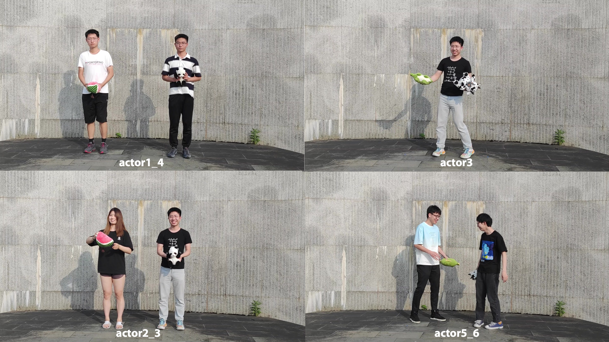
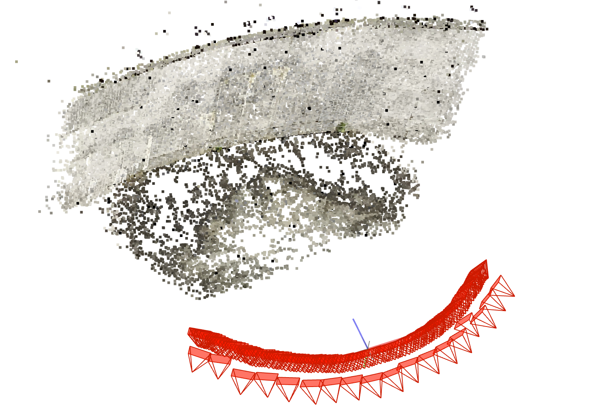

# ENeRF-Outdoor
## Introduction
**ENeRF-Outdoor** is a dynamic dataset of multi-purpose outdoor scenes, collected by 18 synchronized cameras. Each sequence generally has about 1000 frames and has complex motions.

Here is a visualization generated using colmap during calibration, which can be used to view the distribution of cameras. The front row of cameras in the picture is scanned with a mobile phone to provide more matches during calibration.

## Download

If someone wants to download the **ENeRF-Outdoor** dataset, please fill in the agreement, and email me (haotongl@zju.edu.cn) and cc Xiaowei Zhou (xwzhou@zju.edu.cn) and Sida Peng (pengsida@zju.edu.cn) to request the download link.
