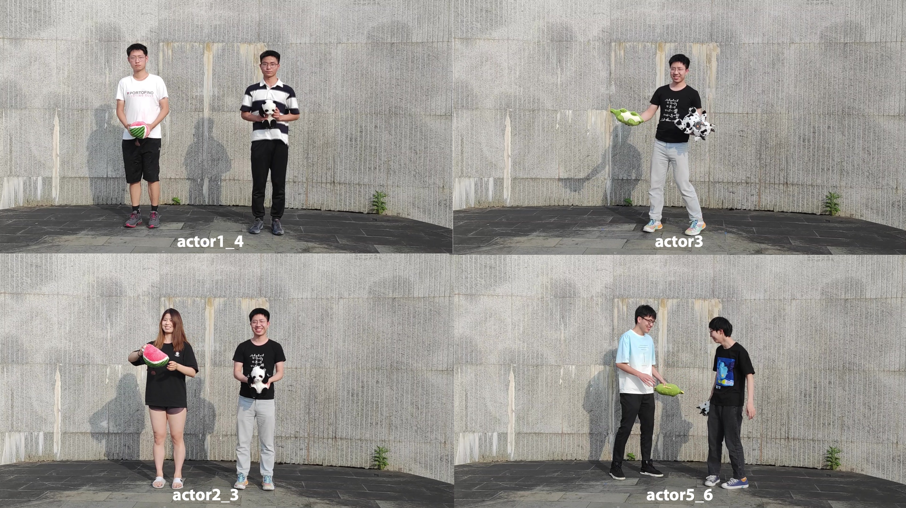
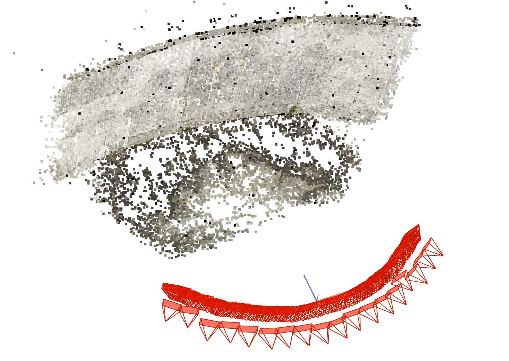

# ENeRF-Outdoor
## Introduction
**ENeRF-Outdoor** is a dynamic dataset of multi-purpose outdoor scenes, collected by 18 synchronized cameras. Each sequence generally has about 1000 frames and has complex motions.


Here is a visualization generated using colmap during calibration, which can be used to view the distribution of cameras. The front row of cameras in the picture is scanned with a mobile phone to provide more matches during calibration.


## Download
To download the **ENeRF-Outdoor** dataset, please complete the [dataset access form](https://docs.google.com/forms/d/e/1FAIpQLScegJgzhgyaUqrw5bybbSDxuqS79dHnWi5_XzgPr5igWG1d9g/viewform) with your full name, institution / affiliation, and advisor / supervisor in English. The download link will be displayed immediately after submission; no email request is required.

Please use the dataset for non-commercial academic research and do not redistribute it.

## Citation
Please cite the following paper to acknowledge the authors' effort in creating this dataset:

```bibtex
@inproceedings{lin2022enerf,
  title={Efficient Neural Radiance Fields for Interactive Free-viewpoint Video},
  author={Lin, Haotong and Peng, Sida and Xu, Zhen and Yan, Yunzhi and Shuai, Qing and Bao, Hujun and Zhou, Xiaowei},
  booktitle={SIGGRAPH Asia Conference Proceedings},
  year={2022}
}
```
